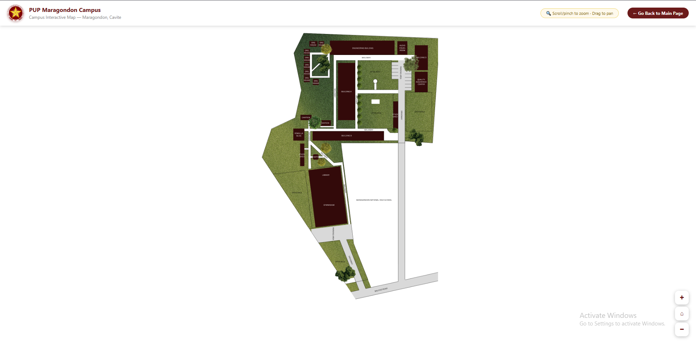
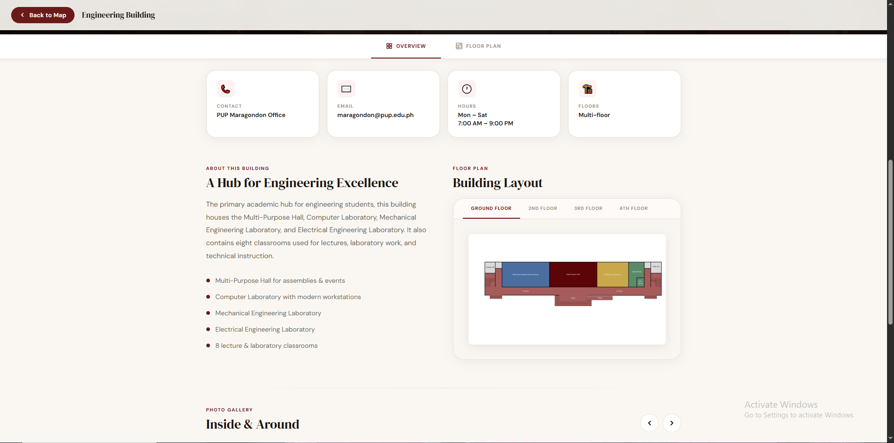
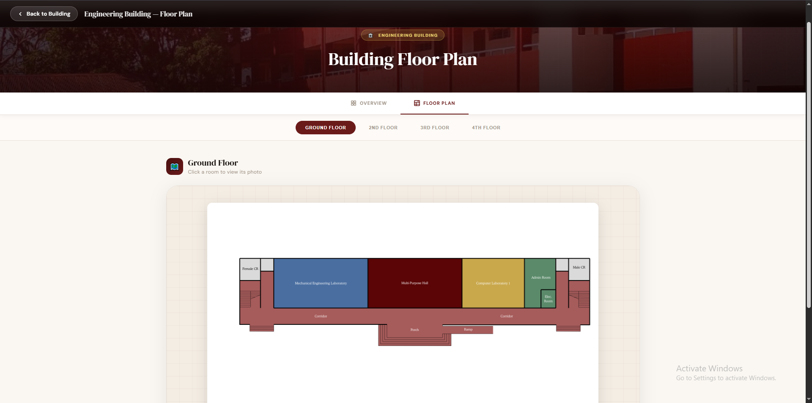

<div align="center">


<h1>PUP Maragondon Campus<br>Interactive Map</h1>

<p><strong>A browser-based interactive campus map for the Polytechnic University of the Philippines – Maragondon Campus.</strong><br>
Tap any building to explore its details, floor plans, and photos — no app, no login, no install.</p>

<br/>

[](https://pupmcinteractivemap.vercel.app)

<br/>


</div>

---

## 📖 Overview

The **PUP Maragondon Campus Interactive Map** is a zero-dependency, browser-based navigation tool built with pure HTML, CSS, and vanilla JavaScript. Students, faculty, and visitors can visually explore the campus — click or tap any building to instantly see its purpose, operating hours, contact info, floor plan, and photo gallery.

> 🎓 Officially built for **Polytechnic University of the Philippines – Maragondon Campus**, Maragondon, Cavite.

---

## ✨ Features

| | Feature | Description |
|---|---|---|
| 🖱️ | **Clickable Building Zones** | 16 precisely mapped hotspots layered over the campus image |
| 📋 | **Instant Info Popups** | Mini card with building name, description, and quick actions |
| 🏛️ | **Full Building Detail Pages** | Hero image, info cards (hours, floors, contact), and gallery |
| 🗂️ | **Floor Plan Viewer** | Dedicated floor plan pages for all major buildings |
| 🖼️ | **Lightbox Photo Gallery** | Full-screen photo viewer per building |
| 🔍 | **Zoom & Pan** | Scroll-to-zoom, drag-to-pan on desktop; pinch & swipe on mobile |
| ⏳ | **Branded Loading Screen** | PUP-maroon splash with animated progress bar on startup |
| 📱 | **Mobile-First Design** | Bottom-sheet popups, tap ripple feedback, pinch-to-zoom |
| ⚡ | **Zero Dependencies** | No npm, no framework, no build step — just open and run |

---

## 🏫 Campus Buildings & Facilities

<details>
<summary><strong>View all 16 mapped locations</strong></summary>

<br/>

| Zone | Building / Facility | Description |
|---|---|---|
| 1 | ⚙️ **Engineering Building** | Houses the Multi-Purpose Hall, Computer Lab, ME & EE Labs, and 8 classrooms |
| 2 | 📽️ **Audio Visual Room** | Multimedia space for seminars and instructional presentations |
| 3 | 📋 **Quality Assurance Center** | Manages academic standards, accreditation, and compliance |
| 4 | 🏢 **Building A** | Registrar, OSS, Director's Office, Accounting — classrooms on 2nd floor |
| 5 | 🌿 **Study Shed (North)** | Open student collaboration and relaxation space |
| 6 | 🌿 **Study Shed (South)** | Secondary open-air study area |
| 7 | 🏗️ **Building B** | Campus Clinic, Faculty Lounge, Student Council, Chem Lab, classrooms |
| 8 | 🏫 **Remulla Building** | Donated classroom facility for lectures and instruction |
| 9 | ⛪ **Chapel** | Sacred space for prayer and spiritual gatherings |
| 10 | 🏋️ **Gymnasium** | Major events, sports, and physical wellness programs |
| 11 | 📚 **Library** | Academic resources and quiet study — located on Gym 2nd floor |
| 12 | 🤝 **Org House Plaza** | Hub for student organizations and group activities |
| 13 | 🏚️ **Building D** | Reserved for future campus development |
| 14 | 🍽️ **Canteen (×2)** | Two food service locations across the campus |
| 16 | ☀️ **PUP-MC Pylon** | Campus landmark and welcome marker |

</details>

---

## 🛠️ Tech Stack

| Technology | Role |
|---|---|
| **HTML5** | Page structure, building zone overlays, detail & floor plan pages |
| **CSS3** | Animations, responsive layout, popups, lightbox, loading screen |
| **Vanilla JavaScript** | Zoom/pan engine, multi-touch handling, popup routing logic |
| **Vercel** | Hosting & continuous deployment |

---

## 🚀 Getting Started

No installation. No setup. Just clone and open.

```bash
# Clone the repository
git clone https://github.com/izng21/interactivemap.git

# Enter the project folder
cd interactivemap

# Open in your browser
open index.html        # macOS
start index.html       # Windows
xdg-open index.html    # Linux
```

Or visit the **[live deployment →](https://pupmcinteractivemap.vercel.app)**

---

## 📁 Project Structure

```
interactivemap/
│
├── index.html                  # 🗺️  Main map — 16 clickable building zones
├── PUP_MC_MAP.png              # 📸  Campus map base image
├── images/                     # 🖼️  Building photos, logo, gallery assets
├── videos/                     # 🎞   Video Tours of Buildings and Campus
│
│   ╔══ Building Detail Pages ══╗
├── eb_detail.html              # Engineering Building
├── avr_detail.html             # Audio Visual Room
├── qac_detail.html             # Quality Assurance Center
├── ba_detail.html              # Building A
├── bb_detail.html              # Building B
├── orgplaza_detail.html        # Org House Plaza
│
│   ╔══ Floor Plan Pages ══╗
├── eb_fplan.html               # Engineering Building
├── avr_fplan.html              # Audio Visual Room
├── ba_fplan.html               # Building A
├── bb_fplan.html               # Building B
├── orgplaza_fplan.html         # Org House Plaza
└── qac_fplan.html              # Quality Assurance Center
```

---

## 📸 Screenshots

> _Add screenshots below by placing images in the `images/` folder and updating the paths._

| Main Map | Detail Page | Floor Plan |
|:---:|:---:|:---:|:---:|
|  |  |  |

---

## 🤝 Contributing

Contributions are welcome — whether it's adding missing building pages, improving the UI, or fixing a bug.

1. Fork the repository
2. Create a feature branch — `git checkout -b feature/your-feature`
3. Commit your changes — `git commit -m "feat: describe your change"`
4. Push — `git push origin feature/your-feature`
5. Open a Pull Request

---

## 📄 License

This project is intended for academic and institutional use at **PUP – Maragondon Campus**.  
All campus photos and assets are property of the Polytechnic University of the Philippines.

---

<div align="center">

Made with ❤️ for **PUP – Maragondon Campus**<br>
Maragondon, Cavite, Philippines

<br/>

<a href="https://pupmcinteractivemap.vercel.app">🌐 Live Site</a> &nbsp;·&nbsp;
<a href="https://github.com/izng21/interactivemap/issues">🐛 Report a Bug</a> &nbsp;·&nbsp;
<a href="https://github.com/izng21/interactivemap/pulls">🚀 Submit a PR</a>

</div>
